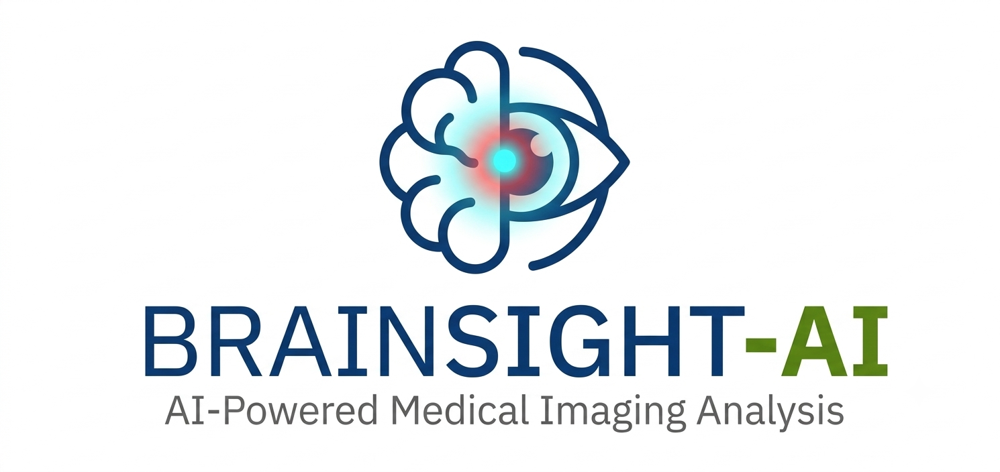
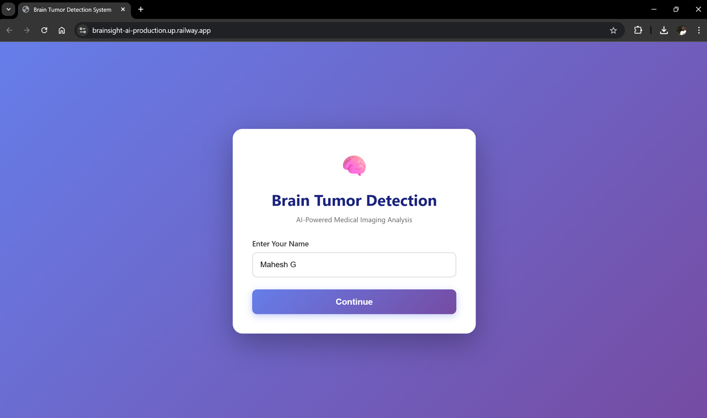
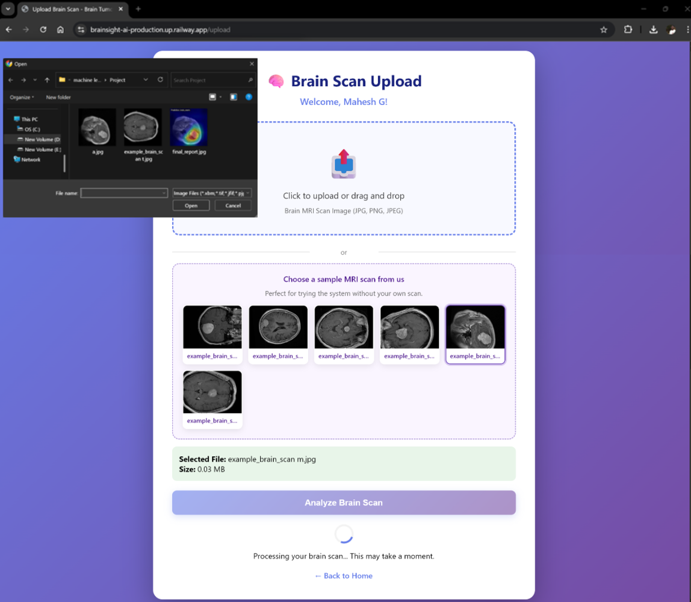
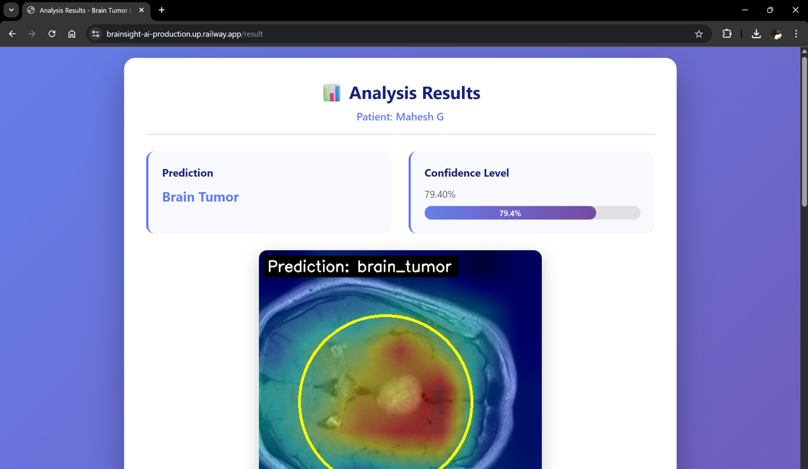
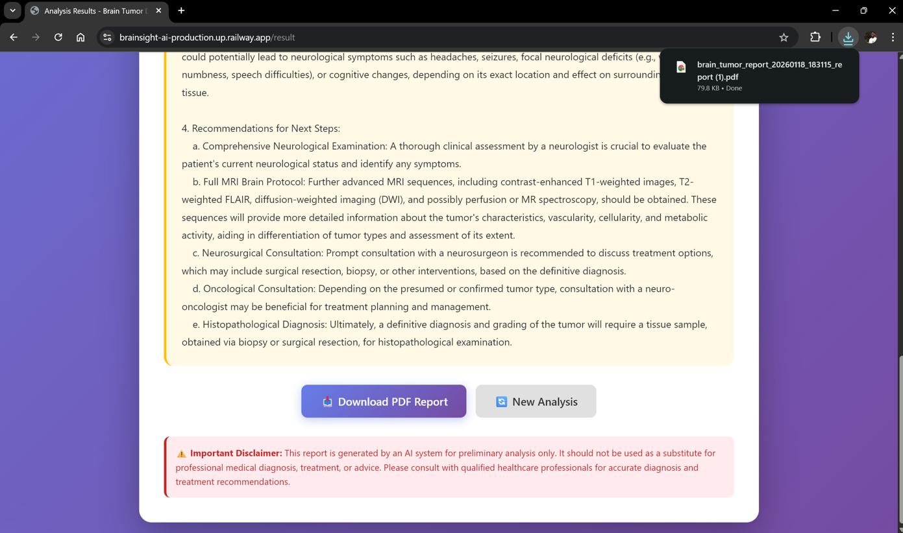

# BrainSight-AI

### Interpretable Brain Tumor Detection with Visual Explainability & AI Medical Reporting

  <b>Developed in Collaboration with AICTE & IBM SkillsBuild (CSRBOX)</b>

---

## 📸 Product Walkthrough

### 1. Patient Portal & MRI Scan Ingestion
| Landing Interface | Multi-Format MRI Upload & Sample Scans |
| :---: | :---: |
|  |  |

### 2. Explainable Classification & Clinical Reports
| Grad-CAM Visual Heatmap | LLM Clinical Analysis & PDF Export |
| :---: | :---: |
|  |  |

---

## 📌 Executive Summary

**BrainSight-AI** is a clinical decision-support system designed to accelerate neuro-oncology screening and eliminate black-box opacity in deep learning diagnostics. Traditional diagnostic workflows rely heavily on continuous radiologist availability, creating severe screening bottlenecks in under-resourced medical environments.

BrainSight-AI implements an end-to-end diagnostic pipeline:
1. **DenseNet Deep Feature Extraction:** Accurately classifies brain MRI scans across multi-class cohorts (Glioma, Meningioma, Pituitary, and Normal).
2. **Visual Explainability via Grad-CAM:** Generates localized class activation heatmaps to highlight precise anatomical regions driving model predictions, ensuring clinical transparency.
3. **Automated Generative Medical Reporting:** Uses the Gemini LLM to synthesize radiological indicators into structured preliminary clinical findings, downloadable as an audit-ready PDF.

Aligned directly with **UN SDG 3 (Good Health and Well-Being)**, the project aims to reduce diagnostic turnaround latency and expand accessible early detection tools.

---

## ✨ Core Features

* **DenseNet CNN Backbone:** Harnesses dense feature connectivity and gradient reuse for fine-grained detection of subtle tumor margins.
* **Explainable AI (XAI):** Integrated Gradient-weighted Class Activation Mapping (Grad-CAM) to verify that inferences focus on pathological tissue rather than imaging artifacts.
* **Intelligent Clinical Synthesis:** Automatically produces structured observations including suspected severity, anatomical localization, and recommended clinical follow-ups.
* **Exportable PDF Documentation:** Complete PDF report generation via ReportLab, compiling patient metadata, confidence intervals, and visualization maps for diagnostic review.
* **Cloud-Native Deployment:** Fully containerized with Docker and served live on Railway PaaS.

---

## 🛠️ Architecture & Tech Stack
